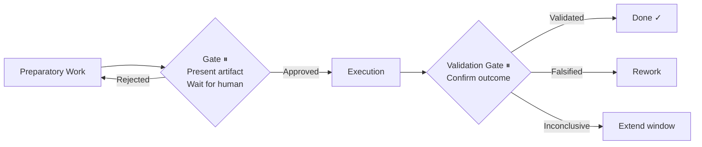
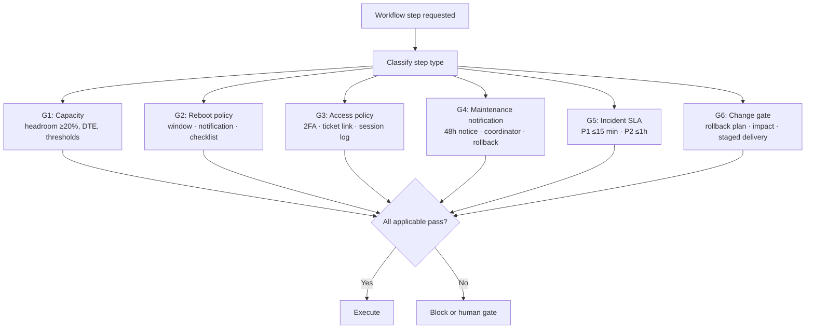

# Autonomous Infrastructure Workflow Architecture

> A reference architecture for AI-agent-driven infrastructure operations — with a regulation-aware Governance Layer that keeps autonomous execution aligned with your team's own rules.

---

## The Problem

Infrastructure engineering teams spend **40–55% of capacity on coordination overhead** — approvals without clear owners, ad-hoc escalation chains, knowledge locked in people's heads, regulations that exist in documents but never get checked at runtime.

AI agents can execute infrastructure work autonomously. But autonomy without compliance is risk. And compliance without a clear architecture is just more documentation nobody reads.

**This repository proposes a solution**: an eight-layer reference architecture that combines AI-agent orchestration, human approval gates, and regulation-based governance into a coherent operational model.

---

## Why traditional workflows fail

| Failure mode | Consequence |
|---|---|
| **Coordination overhead** | Infrastructure changes are approved through ad-hoc channels; no defined gate, no defined owner, no audit trail |
| **Context fragmentation** | Knowledge of how systems interact is locked in individuals; each new operator rebuilds context from scratch |
| **Execution drift** | Agents execute without checking applicable regulations; rules exist in documents but are never consulted at runtime |
| **Approval bottlenecks** | Escalation chains are ad-hoc; authority boundaries are implicit; the wrong person approves or no one approves at all |

---

## Eight-Layer Model

```
┌─────────────────────────────────────────────────────────────┐
│  1. TRIGGER          Mission contracts · Tickets · Cron     │
├─────────────────────────────────────────────────────────────┤
│  2. ORCHESTRATION    Workflow engine (epic-driven)           │
│                      INTAKE → DEBATE → [GATE] → EXECUTE     │
├─────────────────────────────────────────────────────────────┤
│  3. GOVERNANCE  ◄── THE NEW LAYER ────────────────────────  │
│                      Capacity · Reboot · Access · SLA ·     │
│                      Maintenance · Change Gate              │
│                      Checks run before every step           │
├─────────────────────────────────────────────────────────────┤
│  4. AGENTS           architect · sre · devops · security…   │
├─────────────────────────────────────────────────────────────┤
│  5. EXECUTION        Decision Gate ⏸ → Execute →            │
│                      Validation Gate ⏸                      │
├─────────────────────────────────────────────────────────────┤
│  6. MEMORY           Shared team memory (semantic search)   │
├─────────────────────────────────────────────────────────────┤
│  7. OBSERVATION      Post-execution outcome check           │
├─────────────────────────────────────────────────────────────┤
│  8. KNOWLEDGE        Regulations · Runbooks · Digests       │
└─────────────────────────────────────────────────────────────┘
```

---

## The Approval Gate Pattern

Three independent components in this architecture independently implement the same principle: **stop before an irreversible action and require explicit human confirmation**.



| Implementation | Scope |
|---|---|
| Epic-driven workflow | Epic → sub-tasks (days to weeks) |
| Task execution model | Individual operational task (minutes to hours) |
| Automation lifecycle | Design → Build → Test → [irreversibility gate] → Deploy |

See [`docs/approval-gate-pattern.md`](docs/approval-gate-pattern.md) for the unified model.

---

## The Governance Layer

The component that keeps autonomous execution aligned with your team's regulations. Before any workflow step that touches production, applicable regulation checks run synchronously — the set is drawn from the org's regulation knowledge base:



Governance is a **synchronous gate** — not an audit log. A step cannot proceed until all applicable checks pass.

See [`docs/governance-layer.md`](docs/governance-layer.md) for regulation examples with specific thresholds and gate behaviours.

---

## Quick Start

**1.** Read [`docs/architecture.md`](docs/architecture.md) — understand the eight layers (5 min)

**2.** Add a Governance pre-flight to your workflow entrypoint:
```markdown
Before any production-touching step, run Governance checks:
G1 Capacity · G2 Reboot · G3 Access · G4 Maintenance · G5 SLA · G6 Change gate
```

**3.** Pick an integration path in [`docs/integration-guide.md`](docs/integration-guide.md)

---

## Practical example

TLS certificate rotation — all eight layers in sequence:

```
Task: rotate TLS certificate on production API gateway

Layer 1 — TRIGGER
  Source: mission contract "rotate tls cert on api-gateway-prod"

Layer 2 — ORCHESTRATION
  Subtasks: retrieve current cert · generate new cert · deploy [irreversible] · validate

Layer 3 — GOVERNANCE (runs before the deploy step)
  G1 Capacity: headroom 41% ✓  |  G3 Access: session linked to ticket CERT-8821, 2FA verified ✓
  G6 Change Gate: rollback plan documented, rollback < 5 min ✓
  All applicable pass → proceed

Layer 4 — AGENTS
  Security agent: retrieves current cert, checks expiry (12 days remaining)
  DevOps agent:   generates new cert via internal CA

Layer 5 — EXECUTION
  G1 Decision Gate ⏸
    Context: expiry in 12 days | new cert valid 365 days | rollback: restore previous cert < 5 min
    → Approved
  G3 Irreversibility Gate ⏸ (before deploy)
    Action: replace TLS cert on api-gateway-prod | blast radius: all API traffic during rotation (< 2s)
    Rollback: restore previous cert from backup
    → Approved
  Cert deployed.
  G2 Validation Gate ⏸
    Evidence: new cert active ✓ | expiry 365 days ✓ | zero SSL errors in 5-min window ✓
    → Validated

Layer 6 — MEMORY
  Logged to team memory: cert last rotated 2026-05-26, next due 2027-05-26

Layer 7 — OBSERVATION
  SSL error rate: 0% post-rotation ✓

Layer 8 — KNOWLEDGE
  Rotation runbook updated with new expiry date
```

---

## Contents

| Path | Description |
|---|---|
| [`docs/architecture.md`](docs/architecture.md) | Eight-layer model — full descriptions and design principles |
| [`docs/approval-gate-pattern.md`](docs/approval-gate-pattern.md) | The unified gate pattern and its three implementations |
| [`docs/governance-layer.md`](docs/governance-layer.md) | Regulation examples with thresholds and gate behaviours |
| [`docs/integration-guide.md`](docs/integration-guide.md) | How to integrate into existing workflow tooling |
| [`docs/system-overview.md`](docs/system-overview.md) | How the five repositories fit together — layered diagram, concept map, composed use-case traces |

---

## Design principles

**Governance is a synchronous gate, not an audit log.** A step cannot proceed until all applicable checks pass. Logging that an action happened provides accountability without control. The governance layer runs before every production-touching step — not after.

**Each layer has a defined contract with adjacent layers.** The trigger layer delivers a typed work item to orchestration. The governance layer delivers a pass/block decision to the agent layer. The execution layer delivers an evidence package to validation. Undefined interfaces between layers are where execution drift enters.

**Eight layers are not optional.** Removing the governance layer means agents execute without regulation checks. Removing the observation layer means outcome drift goes undetected — you cannot tell whether a change achieved its intended effect. Removing the knowledge layer means regulations are hardcoded and stale. Each layer exists because systems without it have failed in specific, documented ways.

**Regulations are operational, not documentary.** A regulation that is checked at runtime — even if it results in a gate or a block — is a regulation doing its job. A regulation that exists in a document but is never consulted at execution time provides no operational protection.

---

## How this fits in the ecosystem

**[ai-operational-execution](https://github.com/dddeeemmm/ai-operational-execution)** — implements Layer 5 of this architecture: the execution model (context assembly → Decision Gate → execution → Validation Gate). ai-operational-execution is the starting point for teams adopting the stack.

**[ai-approval-gates](https://github.com/dddeeemmm/ai-approval-gates)** — the full specification of the Approval Gate Pattern referenced in `docs/approval-gate-pattern.md`. Where this repository describes three implementations of the same principle, ai-approval-gates defines the complete gate taxonomy (G1–G5), the state machine, and the conformance properties that make a gate implementation correct.

**[ai-governance-patterns](https://github.com/dddeeemmm/ai-governance-patterns)** — implements the retrieval mechanics behind the Governance Layer (Layer 3). The regulation examples described in `docs/governance-layer.md` become dynamic and current through RAG retrieval: regulations live in a knowledge base, are queried at execution time, and determine which gate type fires.

**[ai-orchestration-patterns](https://github.com/dddeeemmm/ai-orchestration-patterns)** — names the coordination patterns used across all eight layers. Sequential Gate (Pattern 02) is the named form of the Approval Gate Pattern. Knowledge Cache (Pattern 05) is the structural form of the RAG layer. Coordinator-Delegate (Pattern 06) is how the Agent Layer composes specialist agents. The pattern catalog gives these architectural components reusable, portable names.
