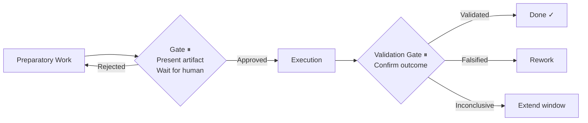
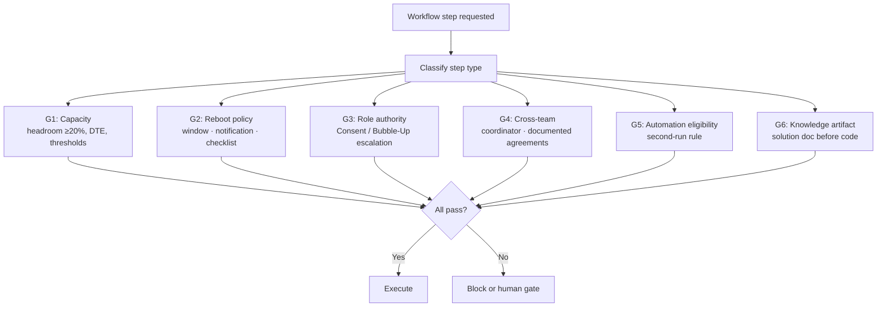

# Autonomous Infrastructure Workflow Architecture

> A reference architecture for AI-agent-driven infrastructure operations — with a regulation-aware Governance Layer that keeps autonomous execution aligned with your team's own rules.

---

## The Problem

Infrastructure engineering teams spend **40–55% of capacity on coordination overhead** — approvals without clear owners, ad-hoc escalation chains, knowledge locked in people's heads, regulations that exist in documents but never get checked at runtime.

AI agents can execute infrastructure work autonomously. But autonomy without compliance is risk. And compliance without a clear architecture is just more documentation nobody reads.

**This repository proposes a solution**: an eight-layer reference architecture that combines AI-agent orchestration, human approval gates, and regulation-based governance into a coherent operational model.

---

## Eight-Layer Model

```
┌─────────────────────────────────────────────────────────────┐
│  1. TRIGGER          Mission contracts · Tickets · Cron     │
├─────────────────────────────────────────────────────────────┤
│  2. ORCHESTRATION    Workflow engine (epic-driven)           │
│                      INTAKE → DEBATE → [GATE] → EXECUTE     │
├─────────────────────────────────────────────────────────────┤
│  3. GOVERNANCE  ◄── THE NEW LAYER ────────────────────────  │
│                      Capacity · Reboot · Role · Cross-team  │
│                      Checks run before every step           │
├─────────────────────────────────────────────────────────────┤
│  4. AGENTS           architect · sre · devops · security…   │
├─────────────────────────────────────────────────────────────┤
│  5. EXECUTION        Decision Gate ⏸ → Execute →            │
│                      Validation Gate ⏸                      │
├─────────────────────────────────────────────────────────────┤
│  6. MEMORY           Shared team memory (semantic search)   │
├─────────────────────────────────────────────────────────────┤
│  7. OBSERVATION      Cell metrics · Capacity assess ·       │
│                      Incident investigation                  │
├─────────────────────────────────────────────────────────────┤
│  8. KNOWLEDGE        Regulations · Runbooks · Digests       │
└─────────────────────────────────────────────────────────────┘
```

---

## The Approval Gate Pattern

Three independent components in this architecture independently implement the same principle: **stop before an irreversible action and require explicit human confirmation**.



| Implementation | Scope |
|---|---|
| Epic-driven workflow | Epic → sub-tasks (days to weeks) |
| Task execution model | Individual operational task (minutes to hours) |
| Automation lifecycle | Design → Build → Test → [irreversibility gate] → Deploy |

See [`docs/approval-gate-pattern.md`](docs/approval-gate-pattern.md) for the unified model.

---

## The Governance Layer

The component that keeps autonomous execution aligned with your team's regulations. Before any workflow step that touches production, six checks run synchronously:



Governance is a **synchronous gate** — not an audit log. A step cannot proceed until all applicable checks pass.

See [`docs/governance-layer.md`](docs/governance-layer.md) for all six rules with specific thresholds and gate behaviours.

---

## Quick Start

**1.** Read [`docs/architecture.md`](docs/architecture.md) — understand the eight layers (5 min)

**2.** Add a Governance pre-flight to your workflow entrypoint:
```markdown
Before any production-touching step, run Governance checks:
G1 Capacity · G2 Reboot · G3 Role · G4 Cross-team · G5 Automate · G6 Solution doc
```

**3.** Pick an integration path in [`docs/integration-guide.md`](docs/integration-guide.md)

---

## Contents

| Path | Description |
|---|---|
| [`docs/architecture.md`](docs/architecture.md) | Eight-layer model — full descriptions and design principles |
| [`docs/approval-gate-pattern.md`](docs/approval-gate-pattern.md) | The unified gate pattern and its three implementations |
| [`docs/governance-layer.md`](docs/governance-layer.md) | Six regulation-based checks with thresholds and gate behaviours |
| [`docs/integration-guide.md`](docs/integration-guide.md) | How to integrate into existing workflow tooling |

---

## Related

- [ai-opex](https://github.com/dddeeemmm/ai-opex) — the execution model (Layer 5): Decision Gate → Execute → Validation Gate
- [ai-automations](https://github.com/dddeeemmm/ai-automations) — reference implementation of scheduled operational workflows (Layer 8)
