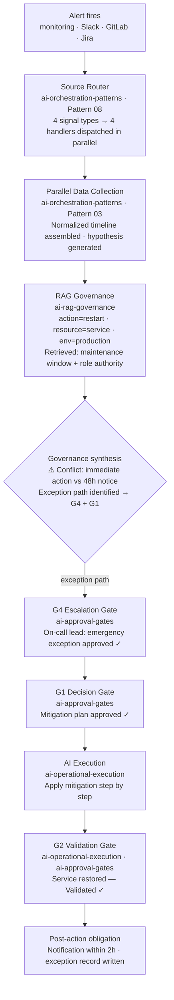
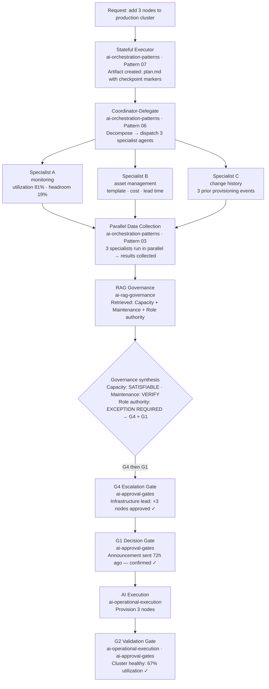

# System Overview

How five repositories form a coherent system for AI-assisted infrastructure operations.

Each repository is independently useful. Together they cover the full stack: from naming the problem (ai-operational-execution) to specifying human checkpoints (ai-approval-gates) to retrieving applicable rules (ai-rag-governance) to naming the coordination patterns (ai-orchestration-patterns) to showing how it all fits into one architecture (this repository).

---

## Conceptual layers

```
┌─────────────────────────────────────────────────────────────────────┐
│  LAYER 0 — EXECUTION MODEL                                          │
│  ai-operational-execution                                                            │
│  The operational contract: AI prepares, human approves, AI          │
│  executes. Decision Gate (G1) → Execute → Validation Gate (G2).    │
│  The foundation every other layer builds on.                        │
├─────────────────────────────────────────────────────────────────────┤
│  LAYER 1 — GOVERNANCE                                               │
│  ai-rag-governance          ai-approval-gates                       │
│  What rules apply?          How do you enforce them?                │
│  RAG retrieval at           Five gate types (G1–G5), state          │
│  execution time.            machine, conformance properties.        │
│  Routes to gate types.      ◄── receives routing from RAG.          │
├─────────────────────────────────────────────────────────────────────┤
│  LAYER 2 — REFERENCE ARCHITECTURE                                   │
│  ai-infra-workflow-arch  ◄── YOU ARE HERE                           │
│  Eight-layer model: Trigger · Orchestration · Governance ·          │
│  Agents · Execution · Memory · Observation · Knowledge.             │
│  Integration paths for adopting the full stack.                     │
├─────────────────────────────────────────────────────────────────────┤
│  LAYER 3 — COORDINATION PATTERNS                                    │
│  ai-orchestration-patterns                                          │
│  Eight named patterns (Composite, Sequential Gate, Parallel         │
│  Collection, Investigative Fan-Out, Knowledge Cache,                │
│  Coordinator-Delegate, Stateful Executor, Source Router).           │
│  The structural vocabulary for building any of the above.           │
└─────────────────────────────────────────────────────────────────────┘
```

---

## Concept-to-repository map

| Concept | Repository | Where to look |
|---|---|---|
| Decision Gate + Validation Gate | [ai-operational-execution](https://github.com/dddeeemmm/ai-operational-execution) | `docs/whitepaper.md` |
| Execution model (4-phase) | [ai-operational-execution](https://github.com/dddeeemmm/ai-operational-execution) | `skills/execution-model/SKILL.md` |
| Gate taxonomy (G1–G5) | [ai-approval-gates](https://github.com/dddeeemmm/ai-approval-gates) | `docs/framework.md` |
| Gate state machine | [ai-approval-gates](https://github.com/dddeeemmm/ai-approval-gates) | `docs/framework.md` |
| Gate conformance properties | [ai-approval-gates](https://github.com/dddeeemmm/ai-approval-gates) | `docs/framework.md` |
| Regulation retrieval lifecycle | [ai-rag-governance](https://github.com/dddeeemmm/ai-rag-governance) | `docs/framework.md` |
| Regulation KB integration | [ai-rag-governance](https://github.com/dddeeemmm/ai-rag-governance) | `docs/kb-integration.md` |
| Gate routing from regulations | [ai-rag-governance](https://github.com/dddeeemmm/ai-rag-governance) | `docs/framework.md §Gate routing` |
| Eight-layer architecture | [ai-infra-workflow-arch](https://github.com/dddeeemmm/ai-infra-workflow-arch) | `docs/architecture.md` |
| Governance Layer (G1–G6 rules) | [ai-infra-workflow-arch](https://github.com/dddeeemmm/ai-infra-workflow-arch) | `docs/governance-layer.md` |
| Adoption paths | [ai-infra-workflow-arch](https://github.com/dddeeemmm/ai-infra-workflow-arch) | `docs/integration-guide.md` |
| Sequential Gate pattern | [ai-orchestration-patterns](https://github.com/dddeeemmm/ai-orchestration-patterns) | `docs/patterns/02-sequential-gate.md` |
| Knowledge Cache pattern | [ai-orchestration-patterns](https://github.com/dddeeemmm/ai-orchestration-patterns) | `docs/patterns/05-knowledge-cache.md` |
| Coordinator-Delegate pattern | [ai-orchestration-patterns](https://github.com/dddeeemmm/ai-orchestration-patterns) | `docs/patterns/06-coordinator-delegate.md` |
| Stateful Executor pattern | [ai-orchestration-patterns](https://github.com/dddeeemmm/ai-orchestration-patterns) | `docs/patterns/07-stateful-executor.md` |
| Source Router pattern | [ai-orchestration-patterns](https://github.com/dddeeemmm/ai-orchestration-patterns) | `docs/patterns/08-source-router.md` |
| Pattern composition + playbook | [ai-orchestration-patterns](https://github.com/dddeeemmm/ai-orchestration-patterns) | `docs/playbook.md` |

---

## Composed use-case traces

Two scenarios that show multiple repositories working together in a single workflow.

---

### Use-case 1 — Incident investigation and response

An alert fires. An agent investigates, retrieves applicable regulations, routes to the correct approval gate, and applies a fix only after explicit human sign-off.

**Repositories involved:** ai-orchestration-patterns · ai-rag-governance · ai-approval-gates · ai-operational-execution



**Pattern composition:** Source Router → Parallel Data Collection → Knowledge Cache (RAG) → Sequential Gate (G4 + G1) → Stateful Executor → Validation Gate (G2)

---

### Use-case 2 — Capacity review before provisioning

An engineer requests additional capacity. Before the agent provisions anything, it retrieves applicable regulations, assembles a cross-team plan, and gates on explicit approval.

**Repositories involved:** ai-rag-governance · ai-approval-gates · ai-orchestration-patterns · ai-operational-execution



**Pattern composition:** Stateful Executor → Coordinator-Delegate → Parallel Data Collection → Knowledge Cache (RAG) → Sequential Gate (G4 + G1) → Execution Model → Validation Gate (G2)

---

## Reading order

If you are new to this system, read in this order:

1. **[ai-operational-execution](https://github.com/dddeeemmm/ai-operational-execution)** — understand the execution model (10 min)
2. **[`docs/architecture.md`](architecture.md)** — understand the eight layers (10 min)
3. **[ai-approval-gates](https://github.com/dddeeemmm/ai-approval-gates)** — understand gate types and conformance (15 min)
4. **[ai-rag-governance](https://github.com/dddeeemmm/ai-rag-governance)** — understand regulation retrieval (15 min)
5. **[ai-orchestration-patterns](https://github.com/dddeeemmm/ai-orchestration-patterns)** — understand coordination patterns (20 min)
6. **[`docs/integration-guide.md`](integration-guide.md)** — choose your adoption path (10 min)
